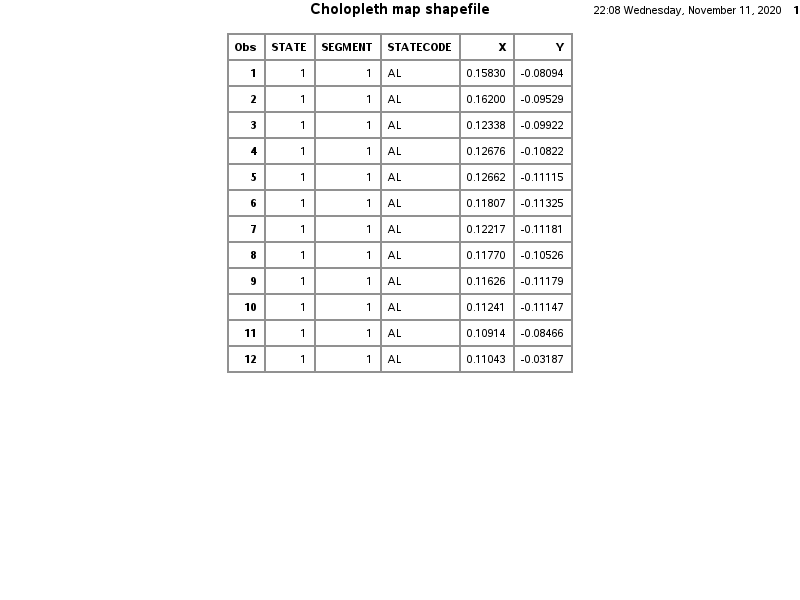
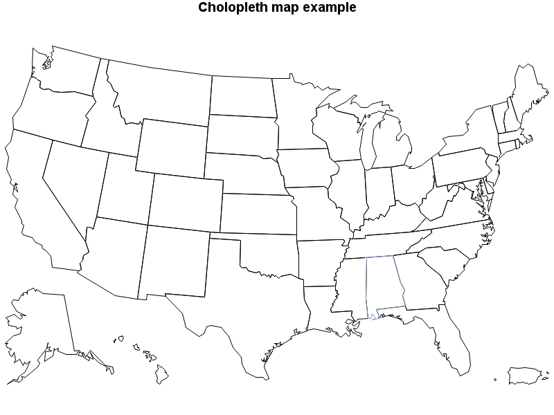

```{r setup, include=FALSE}
# 79: -------------------------------------------------------------------------
knitr::opts_chunk$set(echo = TRUE) # show all code chunks
library(kableExtra)
```

# Introduction

A choropleth map is a very useful tool in visualizing the differences between regions. Using daily count data from Covid-19 obtained from the [COVID Tracking Project](https://covidtracking.com/), we visualize the total number of new infections in the U.S. at the state level.

Furthermore, we show that choropleth maps are powerful for visualizing spatio-temporal data that evolve with time. We create examples of an interactive map for the same dataset where users can change the aggregation period. Users can see which areas were hotspots of infection at which point in time.

Although we only use the U.S. data in this tutorial, we adopt a universal method using *shapefile* instead of using a special package made exclusively for the U.S. (such as `usmap` package in R) to ensure a consistent presentation across software tools and to allow users to apply our tutorial for visualizations in different resolutions (international, state, county, zip code, etc.) and in different situations.

We first explain geographic vector data and shapefiles in general, and then we perform the analytical examples in R, Python and SAS software. The interactive map will be implemented in R and Python only.

# Brief Introduction to Geographic Vector Data

*Note: This section will use some codes to show plots and vectors, but will not be repeated in multiple languages, because these are just for explanation and not directly related to our examples.*

*shapefile* is a kind of GIS (Geographic Information System) format that can store the location, shape, and attribute information of geographical objects such as national and state borders, buildings, streets, etc.

It was originally developed by ESRI, a U.S. GIS-related company, but its specifications are publicly available and widely used by governmental and non-governmental organizations around the world. For example, the U.S. Census Bureau [provides shapefiles of the U.S.](https://www.census.gov/geographies/mapping-files/time-series/geo/carto-boundary-file.html) at different levels, such as national, state, county, congressional district, and zip code. National and regional government agencies around the world also provide shapefiles, and there is a website ([Natural Earth](https://www.naturalearthdata.com/)) that provides public domain world map data. Individuals can easily and accurately draw a map of any part of the world for free.

shapefile is not a single file, but is composed of multiple files, all of which must be used together. It consists of at least the following three files.

 - `.shp` stores coordinates of the geometric shapes
 - `.dbf` stores attribute information of the shapes (name, area, and other variables such as population)
 - `.shx` indexes and connects the shapes in `.shp` and the attributes in `.dbf`

To simplify the explanation, you can think of it as a table in R, Python, STATA, SAS, etc., with additional columns storing vector data shaped like geographical objects.

## Understanding Polygons

When you load a shapefile, it may look like a typical table you see in .csv, but it should contain a column called `geometry` which stores vector data consisting of points, lines and polygons.

In contrast, there is another format called raster data. Rasters are composed of cells arranged on a grid, and can also represent topographical information such as elevation. We won't cover it in this tutorial.

Most of the objects on the map can be represented by a combination of points, lines and polygons. Points are used for bus stops etc., lines are used for streets etc., and polygons are used for buildings, borders, etc. Administrative districts are often represented by a combination of disjoint polygons (*multi polygons*), as they often include remote islands and/or isolated regions.

The following figure shows vector data of points, lines and polygons in a Cartesian coordinate system.

```{r demonstrate_sf_points, message=FALSE, echo=FALSE, fig.height=5}
library(tidyverse); library(ggplot2); library(ggpubr); library(sf)
# set coordinates to draw
area_51 = c(37.234332396, -115.80666344)
random_point = st_point(c(37.6, -115.4)) 
# Point
point1 = st_point(area_51)
p1 = ggplot() +
  geom_sf(data = point1) +
  theme_bw() +
  ggtitle("Point") +
  xlim(c(37, 38)) +
  ylim(c(-116, -115))
# Multipoint
point2 = st_multipoint(rbind(area_51, random_point))
p2 = ggplot() +
  geom_sf(data = point2) +
  theme_bw() +
  ggtitle("Multi Point") +
  xlim(c(37, 38)) +
  ylim(c(-116, -115))

# set coordinates to draw squares
square1 = list(rbind(c(0, 0), c(0, 1), c(1, 1), c(1, 0), c(0, 0)))
square2 = list(rbind(c(2, 2), c(2, 3), c(3, 3), c(3, 2), c(2, 2)))
hole = list(rbind(c(2.25, 2.25), c(2.25, 2.75), c(2.75, 2.75),
                  c(2.75, 2.25), c(2.25, 2.25)))
# Polygon
polygon = st_polygon(x = square1)
p3 = ggplot() +
  geom_sf(data = polygon, fill = NA) +
  theme_bw() +
  ggtitle("Polygon")
# Multipolygon
multipolygon = st_multipolygon(list(square1, square2, hole))
p4 = ggplot() +
  geom_sf(data = multipolygon, fill = NA) +
  theme_bw() +
  ggtitle("Multi Polygon")

# show plots
ggarrange(p1, p2, p3, p4, nrow = 2, ncol = 2)
```

Next, using Michigan as an example, we display Michigan's vector data on the Cartesian coordinate system.

```{r draw_michigan_map, echo=FALSE, fig.height=5}
filename = "./maps/cb_2018_us_state_500k.shp"
sf_us = read_sf(filename)
sf_us %>% 
  filter(NAME == "Michigan") %>% 
  ggplot() +
  geom_sf(fill = NA) +
  theme_bw() +
  ggtitle("Michigan")
```

The only difference from previous figures is that the x-axis and y-axis have now been changed to a geographic coordinate system consisting of latitude and longitude. With the International Date Line as an edge, the x-axis has a range of -180 to 180 degrees from west to east, and the y-axis has a range of -90 to 90 degrees from south to north. This system sounds very intuitive.

However, without some transformation, latitude and longitude cannot be displayed in a Cartesian coordinate system on a flat surface. The next section explains how to deal with geographic coordinates and project them onto a flat surface.

## Understanding Geographic Coodinate System

There are not many things you have to worry about when drawing a map because in many cases, the software will take care of it. However it should be noted that geographic coordinate systems are actually quite complex.

Since the Earth is not exactly round, the values of latitude and longitude vary slightly depending on how you approximate the Earth's surface and what point on the Earth you use as a reference point. Thus, there are several different ***Coordinate Reference Systems (CRSs)*** available in the world. They approximate the Earth's surface somehow and define the relationship between the geographic objects and the surface of the Earth. Since you cannot join multiple `shapefile` that are based on different CRSs, you should check what CRS your shapefile is based on and transform them if needed.

In addition to the problem of defining coordinates, there is another problem of how to represent an object on the surface of a sphere on a flat plane. The coordinates defined by angles (i.e., longitude and latitude) cannot be transformed into Cartesian coordinates without some distortion.

The first problem is addressed by ***Geographic CRSs*** and the second by ***Projected CRSs***.

***Geographic CRSs*** approximate the Earth's surface by an ellipsoid shape and identify a location on the surface by using two angles, longitude and latitude. The most common *Geographic CRSs* include:

 - *The North American Datum of 1983 (NAD 83)* is commonly used by U.S. federal agencies and is optimized for accuracy in the United States, Canada, Mexico, and Central America.
 - *World Geodetic System of 1984 (WGS 84)* is commonly used by international organizations and uses the Earth's center of gravity as a reference point. It is not optimized for any local region.

***Projected CRSs*** refer to the coordinate systems used for 2-dimensional projection. When drawing a map, locations on the Earth's surface must be projected onto a flat paper, display, etc., which may result in some distortion. In practice, we need to project a point defined in *Geographic CRSs* onto 2-dimensional x (east-west) axis and y (north-south) axis. There are many different projection methods available, and each has both strengths and weaknesses. You should carefully choose one for its intended purpose. The most common *Projected CRSs* include:

 - *Mercator* draws a familiar rectangular map and can preserve local directions and shapes. However, it distorts distance and inflates the sizes of countries away from the equator.
 - *Albers Equal Area* preserve accurate area measurement but distorts linear scale and shapes.

In this tutorial, we use `NAD 83` as our *Geographic CRS* and `Mercator` as our *Projected CRS*.

## "Edge Case": Object on the International Date Line

Another small issue is that although the boundaries are actually continuous on the Earth's surface, some countries are divided by the International Date Line. For example, a part of Alaska exists exactly on the International Date Line. As a result, Alaska is shown separately on the western-most and eastern-most sides of the world map.

Different software has different ways of dealing with this, but it is sometimes necessary to shift the entire coordinate system.

# Prepare Geographic Vector Data to Display

The US Census Bureau provides free cartographic boundary data at the national, state, county, zip code and other levels. For this tutorial, we used the following state-level boundary data:

 - `cb_2018_us_state_500k.zip`

We unzipped this compressed file and saved the entire contents into a subdirectory called `./maps`.

## Software Requirements {.tabset}

### R

```{r gis_packages_R, message=FALSE}
library(tidyverse) # Data handling
library(ggplot2) # Generating plots
library(ggpubr) # Helper functions for `ggplot2` e.g. multiple plots
library(sf) # handling shapefiles
```

### Python

### SAS

We will use the `gamp` procedure in Map library in this tutorial. Unfortunately, `gamp` procedure is not available for the free university edition. But we can access that procedure by using SAS on [midesktop](https://midesktop.umich.edu/portal/webclient/index.html#/launchitems) through the UM computing service. In this tutorial, we use SAS 9.4. 

## How to Handle Shapefiles {.tabset}

### R

*will insert explanation of `sf` package*

We can create a `sf` object by loading a shapefile using `read_sf`.

`read_sf` is an alias for `st_read`. `read_sf` returns a tibble rather than data.frame.

```{r read_shapefile_R}
# read shapefile
filename = "./maps/cb_2018_us_state_500k.shp"
sf_us = read_sf(filename)
```

We can see the resulting object is a tibble. Therefore, operations such as deleting certain states from the map can be easily performed using `dplyr`. We can also check what kind of CRS this object is using from this output.

```{r show_sf_tibble_R, message=FALSE}
head(sf_us, 5)
```

### Python

### SAS

Drawing the cholopleth map in SAS is simple since SAS have already included the shapefile for us. We can use the data `map.us` to see what shapefiles look like in the SAS. 

```{r,eval = FALSE}
proc print data = maps.us (OBS = 12);
run;
```


*will insert the explanation about the shape file*


## How to Draw a US Map {.tabset}

### R

You can easily draw state boundaries recorded as multi polygons in the `geometry` column by passing `sf` objects to `ggplot2`.

*will insert explanation of ggplot2 and `geom_sf()`, `coord_sf(xlim, ylim)`*

```{r draw_us_whole_R, cache=TRUE, fig.height=5}
sf_us %>% 
  ggplot() +
  geom_sf() +
  coord_sf(xlim = c(-180, 180), ylim = c(-90, 90)) +
  theme_bw()
```

The Census Bureau's shapefiles also include coordinates for Alaska, Hawaii, or other distant territories, so they are not displayed at the scale we desire. The easiest solution is to drop the rows that contain these off-mainland states and territories.

```{r draw_us_dropped_R, cache=TRUE, fig.height=5}
sf_us %>% 
  filter( !(NAME %in% c("Alaska",
                        "Hawaii",
                        "Puerto Rico",
                        "Guam",
                        "United States Virgin Islands",
                        "Commonwealth of the Northern Mariana Islands",
                        "American Samoa")) ) %>% 
  ggplot() +
  geom_sf() +
  coord_sf() +
  theme_bw()
```

However, we want to include Alaska and Hawaii because our purpose is to make a state-by-state comparison. For practical purposes, scaled Alaska and Hawaii are typically shown as annotations under southern California. This can be accomplished manually by scaling and shifting the original objects. We take out only Alaska and Hawaii, apply an affine transformation to scale and shift them, and then put them back into the original tibble.

But before that, since Alaska is on the date line and divided into two pieces as mentioned above, we shift all coordinates of the United States below 0 (-180-0 degree in longitude) to 180-360 degrees. This can be achieved by applying `st_shift_longitude()` to `geometry` column of `sf` objects.

```{r coord_system_R}
# Change to 0-360 system, with Alaska and Hawaii retained
sf_us_360 = sf_us %>% 
  filter( !(NAME %in% c("Puerto Rico",
                        "Guam",
                        "United States Virgin Islands",
                        "Commonwealth of the Northern Mariana Islands",
                        "American Samoa")) ) %>% 
  mutate(geometry = st_shift_longitude(geometry))
```

*will insert explanation of affine transformation of geometries*

$$
f(x) = xA + b
$$

```{r affine_func}
affine_trans = function(sf_obj, scale, shift_lon_lat) {
  # Scale sf geometries around their original centroid, and shift it
  # horizontally and/or vertically.
  # Inputs: 
  #   sf_obj - simple features you want to scale/shift
  #   scale - numeric value of a factor to be used for scaling up or down
  #   shift_lon_lat - numeric vector indicating amount of shift e.g. c(1,1)
  # Output: sf_obj - updated simple features
  geo = st_geometry(sf_obj)
  st_geometry(sf_obj) = ( (geo - st_centroid(geo)) * scale
                           + shift_lon_lat + st_centroid(geo) )
  return(sf_obj)
}
```

```{r affine_transform_R, warning=FALSE}
# Extract, scale, and shift Alaska
alaska = sf_us_360 %>%
  filter(NAME == "Alaska") %>% 
  affine_trans(scale = .3, shift_lon_lat = c(36, -38))
# Extract, scale, and shift Hawaii
hawaii = sf_us_360 %>% 
  filter(NAME == "Hawaii") %>% 
  affine_trans(scale = .3, shift_lon_lat = c(53, 5))
# Bind back into single object
sf_us_shifted = sf_us_360 %>%
  filter( !(NAME %in% c("Alaska", "Hawaii")) ) %>% 
  bind_rows(alaska, hawaii)
```

*Insert explanation of `coord_sf()` and `crs` argument*

```{r draw_us_transformed_R, cache=TRUE, fig.height=5}
# Mercator Projection
mercator = sf_us_shifted %>% 
  ggplot() +
  geom_sf() +
  coord_sf(crs = "+proj=merc") +
  theme_bw() +
  ggtitle("Mercator Projection")
# Equal Area Projection
equal_area = sf_us_shifted %>% 
  ggplot() +
  geom_sf() +
  coord_sf(crs = "+proj=aea +lat_1=25 +lat_2=50 +lon_0=-100") +
  theme_bw() +
  ggtitle("Equal Area Projection")

# Show plot
ggarrange(mercator, equal_area, ncol = 2)
```

The final map we will use in the later sections is the one with Alaska and Hawaii, projected by Mercator CRS.

```{r final_map_R, cache=TRUE, fig.height=5}
sf_us_shifted %>% 
  ggplot() +
  geom_sf(fill = NA) +
  coord_sf(crs = "+proj=merc") +
  theme_void() # hide coordinates and grid line for visibility
```

### Python

 - draw a raw map
 - drop unnecessary territories
 - shift Alaska and Hawaii somehow
 - create a similar final US map

### SAS

After including the 




# Prepare Count Data to Display

In this tutorial, we used the following variables in the state-level data.

 - `state` - two-letter abbreviation for the state or territory.
 - `date` - date formatted as `yyyy-mm-dd`
 - `positiveIncrease` - daily increase in total number of confirmed plus probable cases of COVID-19

For more information on this dataset, including definitions of variable names, see [Data Definitions](https://covidtracking.com/about-data/data-definitions) provided by The COVID Tracking Project.

## Software Requirements {.tabset}

### R

```{r aggregate_packages_R, message=FALSE}
# Same as the previous sections
library(tidyverse)
# New in this section
library(lubridate) # Aggregation by Datetime
```

### Python

### SAS

## Merge COVID-19 Count with Geographic Data {.tabset}

### R

```{r prepare_data_R, message=FALSE}
# Download up-to-date .csv
df_covid = read_csv(
  url("https://covidtracking.com/data/download/all-states-history.csv")
  )

# Select variables and delete territories
df_covid = df_covid %>% 
  select(date, state, positiveIncrease) %>% 
  filter( !(state %in% c("AS", "GU", "MP", "PR", "VI")) )
```

*Insert explanatio of `quarter()` function in `lubridate` package*

```{r aggregate_state_q, message=FALSE}
# Aggregate by State and Quarter
df_state_q = df_covid %>% 
  mutate(q = quarter(date, with_year = TRUE)) %>% 
  group_by(q, state) %>% 
  summarise(total_pos = sum(positiveIncrease)) %>% 
  ungroup()

# Store maximum value for consistent plots for all quarters
max_positive = max(df_state_q$total_pos)

# Pivot to wide
df_state_q = df_state_q %>% 
  pivot_wider(id_cols = state, names_from = q, values_from = total_pos)
```

```{r merge_map_and_data}
# Merge with sf object
sf_merged = sf_us_shifted %>% 
  left_join(df_state_q, by = c("STUSPS" = "state"))
```

```{r show_merged_sf}
sf_merged %>% 
  select(5,6,10,11,12,13,14) %>% # only show related columns
  head(5) %>% 
  kable(format = 'html', escape = FALSE, align = 'c') %>%
  kable_paper("hover", full_width = TRUE)
```

### Python

### SAS

# Generate Choropleth Maps

## Software Requirements {.tabset}

### R

```{r graphics_packages_R, message=FALSE}
# Same as the previous sections
library(sf); library(tidyverse); library(ggplot2)
# New in this section
library(scales) # determine breaks and labels for graphics
```

### Python

### SAS

## Show Choropleth Maps for each Quarter in 2020 {.tabset}

### R {.tabset}

*will insert an explanation of the following function*

```{r choropleth_func_R}
draw_map_quarter = function(sf_obj, target_q, max_lim) {
  sf_obj %>% 
    ggplot() +
    # Colored by total positives in the selected quarter
    geom_sf(color = NA, # make border lines white for aesthetics
            mapping = aes(fill = .data[[target_q]])) +
    coord_sf(crs = "+proj=merc") +
    theme(
    # Remove background
    panel.border = element_blank(),  
    panel.grid.major = element_blank(),
    panel.grid.minor = element_blank(),
    panel.background = element_blank(),
    # Hide axis
    axis.line = element_blank(),
    axis.text = element_blank(),
    axis.ticks = element_blank(),
    # Adjust legend
    legend.text = element_text(size = 8) ) +
    # Apply color scheme (red)
    scale_fill_distiller(palette = "Reds",
                         # Let more cases = darker color
                         direction = +1,
                         limits = c(0, max_lim),
                         # force all digits to be displayed as comma separated
                         labels = comma_format()) +
    # Adjust size of the color bar in the legend
    guides(fill = guide_colourbar(barwidth = 0.5, barheight = 10)) +
    labs(fill = "Counts")
}
```

#### First Quarter

```{r q1_choropleth_R, cache=TRUE}
# Generate choropleth for each quarter
draw_map_quarter(sf_merged, "2020.1", max_positive) +
  ggtitle("2020 Q1 - Total COVID-19 Cases")
```

#### Second Quarter

```{r q2_choropleth_R, cache=TRUE}
draw_map_quarter(sf_merged, "2020.2", max_positive) +
  ggtitle("2020 Q2 - Total COVID-19 Cases")
```

#### Third Quarter

```{r q3_choropleth_R, cache=TRUE}
draw_map_quarter(sf_merged, "2020.3", max_positive) +
  ggtitle("2020 Q3 - Total COVID-19 Cases")
```

#### Fourth Quarter

```{r q4_choropleth_R, cache=TRUE}
draw_map_quarter(sf_merged, "2020.4", max_positive) +
  ggtitle("2020 Q4 - Total COVID-19 Cases")
```

### Python

### SAS

# Extended Example: Interactive Choropleth Maps

As an extended example, we generate an interactive map that allows users to choose which month to view.

## Software Requirements {.tabset}

### R

```{r interactive_packages_R, message=FALSE}
# Same as the previous sections
library(sf); library(tidyverse); library(ggplot2); library(scales)
# New in this section
library(plotly) # Draw interactive maps with `ggplot2`
```

## Generate Interactive/Animated Choropleth Map {.tabset}

### R

Using the same data set used for the quarterly aggregation, we now aggregate this on a monthly basis.

```{r aggregate_state_month, message=FALSE}
# Aggregate by State and Month
df_state_m = df_covid %>% 
  mutate(month = format(as.Date(date), "%Y-%m")) %>% # "year-month"
  group_by(month, state) %>%
  summarise(total_pos = sum(positiveIncrease)) %>%
  ungroup()

# fill 0 for states not included in early 2020
df_state_m = df_state_m %>% 
  complete(month, state, fill = list(total_pos = 0))
```

```{r merge_map_and_month}
# Merge with sf object
sf_merged_month = df_state_m %>% 
  left_join(sf_us_shifted, by = c("state" = "STUSPS"))
```

We prepared a data frame in which there is one line per month for each state.

```{r show_merged_sf_month}
sf_merged_month %>% 
  filter(NAME == "Florida") %>% 
  select(1,2,8,12,3) %>% # only show related columns
  head(5) %>% 
  kable(format = 'html', escape = FALSE, align = 'c') %>%
  kable_paper("hover", full_width = TRUE)
```

*will insert an explanation about `ggplotly`. `frame` option can be used for an animated slider.*

When users mouse over a state, the number of new infections for that state in that month is shown in a hover view.

January and February 2020 are not shown on this interactive map because data are not available for almost all states.

```{r plotly_R, warning=FALSE, cache=TRUE}
# First create a ggplot object just like before
p = sf_merged_month %>%
  filter(month != "2020-02" & month != "2020-01") %>%
  ggplot(aes(frame = month)) +
  geom_sf(color = NA,
          mapping = aes(fill = total_pos,
                        geometry = geometry,
                        text = paste("Positives in", NAME, "\n",
                                     comma(total_pos, accuracy = 1)))) +
  coord_sf(crs = "+proj=merc") +
  theme(
  # Remove background
  panel.border = element_blank(),  
  panel.grid.major = element_blank(),
  panel.grid.minor = element_blank(),
  panel.background = element_blank(),
  # Hide axis
  axis.line = element_blank(),
  axis.text = element_blank(),
  axis.ticks = element_blank(),
  # Adjust legend
  legend.text = element_text(size = 8) ) +
  # Apply color scheme (red)
  scale_fill_distiller(palette = "Reds",
                       direction = +1,
                       labels = comma_format()) + 
  labs(fill = "Counts")

# Add a slider to change a month to display
fig = ggplotly(p, tooltip = c("text")) %>% 
  animation_opts(transition = 0, redraw = TRUE)
fig
```
