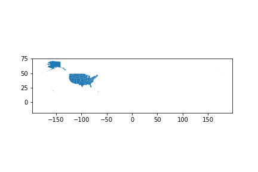
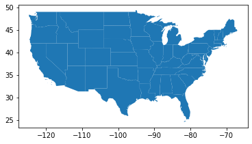
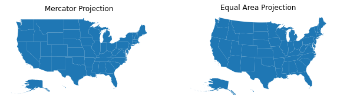
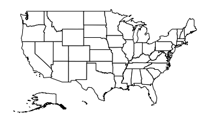

```{r setup, include=FALSE}
# 79: -------------------------------------------------------------------------
knitr::opts_chunk$set(echo = TRUE) # show all code chunks
library(kableExtra)
```

# Introduction

A choropleth map is a very useful tool in visualizing the differences between regions. Using daily count data from Covid-19 obtained from the [COVID Tracking Project](https://covidtracking.com/), we visualize the total number of new infections in the U.S. at the state level.

Furthermore, we show that choropleth maps are powerful for visualizing spatio-temporal data that evolve with time. We create examples of an interactive map for the same dataset where users can change the aggregation period. Users can see which areas were hotspots of infection at which point in time.

Although we only use the U.S. data in this tutorial, we adopt a universal method using *shapefile* instead of using a special package made exclusively for the U.S. (such as `usmap` package in R) to ensure a consistent presentation across software tools and to allow users to apply our tutorial for visualizations in different resolutions (international, state, county, zip code, etc.) and in different situations.

The COVID Tracking Project's state-level data can be downloaded [here](https://covidtracking.com/data/download) and is updated daily. `positive` variable shows the number of positive cases, and we aggregate this variable by month/quarter and visualize them. Although it is possible to download the latest data directly from the URL in software, we use data as of November 11, 2020 in this tutorial in order to make the graphical output of R, Python, and SAS comparable for the same day count.

We first explain geographic vector data and shapefiles in general, and then we perform the analytical examples in R, Python and SAS software. The interactive map will be implemented in R and Python only.

# Brief Introduction to Geographic Vector Data

*Note: This section uses some codes to show sample plots and vectors, but will not be repeated in multiple languages, because these are the very basics of geographic data.*

*shapefile* is a kind of GIS (Geographic Information System) format that can store the location, shape, and attribute information of geographical objects such as national and state borders, buildings, streets, etc.

It was originally developed by ESRI, a U.S. GIS-related company, but its specifications are publicly available and widely used by governmental and non-governmental organizations around the world. For example, the U.S. Census Bureau [provides shapefiles of the U.S.](https://www.census.gov/geographies/mapping-files/time-series/geo/carto-boundary-file.html) at different levels, such as national, state, county, congressional district, and zip code. National and regional government agencies around the world also provide shapefiles, and there is a website ([Natural Earth](https://www.naturalearthdata.com/)) that provides public domain world map data. Individuals can easily and accurately draw a map of any part of the world for free.

shapefile is not a single file, but is composed of multiple files, all of which must be used together. It consists of at least the following three files.

 - `.shp` stores coordinates of the geometric shapes
 - `.dbf` stores attribute information of the shapes (name, area, and other variables such as population)
 - `.shx` indexes and connects the shapes in `.shp` and the attributes in `.dbf`

To simplify the explanation, you can think of it as a table in R, Python, STATA, SAS, etc., with additional columns storing vector data shaped like geographical objects.

## Understanding Polygons

When you load a shapefile, it may look like a typical table you see in .csv, but it should contain a column called `geometry` which stores vector data consisting of points, lines and polygons.

In contrast, there is another format called raster data. Rasters are composed of cells arranged on a grid, and can also represent topographical information such as elevation. We won't cover it in this tutorial.

Most of the objects on the map can be represented by a combination of points, lines and polygons. Points are used for bus stops etc., lines are used for streets etc., and polygons are used for buildings, borders, etc. Administrative districts are often represented by a combination of disjoint polygons (*multi polygons*), as they often include remote islands and/or isolated regions.

The following figure shows vector data of points, lines and polygons in a Cartesian coordinate system.

```{r demonstrate_sf_points, message=FALSE, warning=FALSE, echo=FALSE, fig.height=5, fig.cap=cap}
cap = "***Figure: Examples of displaying vector data***"
library(tidyverse); library(ggplot2); library(ggpubr); library(sf)
# set coordinates to draw
area_51 = c(37.234332396, -115.80666344)
random_point = st_point(c(37.6, -115.4)) 
# Point
point1 = st_point(area_51)
p1 = ggplot() +
  geom_sf(data = point1) +
  theme_bw() +
  ggtitle("Point") +
  xlim(c(37, 38)) +
  ylim(c(-116, -115))
# Multipoint
point2 = st_multipoint(rbind(area_51, random_point))
p2 = ggplot() +
  geom_sf(data = point2) +
  theme_bw() +
  ggtitle("Multi Point") +
  xlim(c(37, 38)) +
  ylim(c(-116, -115))

# set coordinates to draw squares
square1 = list(rbind(c(0, 0), c(0, 1), c(1, 1), c(1, 0), c(0, 0)))
square2 = list(rbind(c(2, 2), c(2, 3), c(3, 3), c(3, 2), c(2, 2)))
hole = list(rbind(c(2.25, 2.25), c(2.25, 2.75), c(2.75, 2.75),
                  c(2.75, 2.25), c(2.25, 2.25)))
# Polygon
polygon = st_polygon(x = square1)
p3 = ggplot() +
  geom_sf(data = polygon, fill = NA) +
  theme_bw() +
  ggtitle("Polygon")
# Multipolygon
multipolygon = st_multipolygon(list(square1, square2, hole))
p4 = ggplot() +
  geom_sf(data = multipolygon, fill = NA) +
  theme_bw() +
  ggtitle("Multi Polygon")

# show plots
ggarrange(p1, p2, p3, p4, nrow = 2, ncol = 2)
```

Next, using Michigan as an example, we display Michigan's vector data on the Cartesian coordinate system.

```{r draw_michigan_map, echo=FALSE, warning=FALSE, fig.height=5, fig.cap=cap}
cap = paste0("***Figure: Example of displaying a geographic object on",
             " the Cartesian coordinate system***")
filename = "./maps/cb_2018_us_state_500k.shp"
sf_us = read_sf(filename)
sf_us %>% 
  filter(NAME == "Michigan") %>% 
  ggplot() +
  geom_sf(fill = NA) +
  theme_bw() +
  ggtitle("Michigan")
```

The only difference from previous figures is that the x-axis and y-axis have now been changed to a geographic coordinate system consisting of latitude and longitude. With the International Date Line as an edge, the x-axis has a range of -180 to 180 degrees from west to east, and the y-axis has a range of -90 to 90 degrees from south to north. This system sounds very intuitive.

However, without some transformation, latitude and longitude cannot be displayed in a Cartesian coordinate system on a flat surface. The next section explains how to deal with geographic coordinates and project them onto a flat surface.

## Understanding Geographic Coodinate System

There are not many things you have to worry about when drawing a map because the software will take care of most of the tedious works. However it should be noted that geographic coordinate systems are actually quite complex, and it's important to understand basics because, as we'll see in this tutorial, sometimes you'll need to transform the coordinates.

Since the Earth is not exactly round, the values of latitude and longitude vary slightly depending on how we approximate the Earth's surface and what point on the Earth we use as a reference point. Thus, there are several different ***Coordinate Reference Systems (CRSs)*** available in the world. They approximate the Earth's surface somehow and define the relationship between the geographic objects and the surface of the Earth. Since we cannot join multiple `shapefile` that are based on different CRSs, we should check what CRS our shapefile is based on and transform them if needed.

In addition to the problem of defining coordinates on the Earth's surface, there is another problem of how to represent an object on the Earth's surface on a flat plane. The coordinates defined by angles (i.e., longitude and latitude) cannot be transformed into Cartesian coordinates without some distortion.

The first problem is addressed by ***Geographic CRSs*** and the second by ***Projected CRSs***.

***Geographic CRSs*** approximate the Earth's surface by an ellipsoid shape and identify a location on the surface by using two angles, longitude and latitude. The most common *Geographic CRSs* include:

 - *The North American Datum of 1983 (NAD 83)* is commonly used by U.S. federal agencies and is optimized for accuracy in the United States, Canada, Mexico, and Central America.
 - *World Geodetic System of 1984 (WGS 84)* is commonly used by international organizations and uses the Earth's center of gravity as a reference point. It is not optimized for any local region.

***Projected CRSs*** refer to the coordinate systems used for 2-dimensional projection. When drawing a map, locations on the Earth's surface must be projected onto a flat paper, display, etc., which may result in some distortion. In practice, we need to project a point defined in *Geographic CRSs* onto 2-dimensional x (east-west) axis and y (north-south) axis. There are many different projection methods available, and each has both strengths and weaknesses. You should carefully choose one for its intended purpose. The most common *Projected CRSs* include:

 - *Mercator* draws a familiar rectangular map and can preserve local directions and shapes. However, it distorts distance and inflates the sizes of countries away from the equator.
 - *Albers Equal Area* preserve accurate area measurement but distorts linear scale and shapes.

In this tutorial, we use `NAD 83` as our *Geographic CRS* and `Mercator` as our *Projected CRS*.

To refer to a CRS, there are two popular formats: the [`EPSG`](https://epsg.io/) format and the [`proj.4`](https://proj.org/) format. For example, `NAD83` is expressed in each format as follows.

 - NAD83 in EPSG format : "EPSG:4269"
 - NAD83 in proj.4 format : "+proj=longlat +ellps=GRS80 +towgs84=0,0,0,0,0,0,0 +no_defs"

The advantage of the `proj.4` notation is that the user can add options to this string. For example, `+lat_0=` sets the latitude of origin, and `+lon_wrap=` sets the longitude to use for wrapping, which determines the left and right edge of the Earth.

Once you know what CRS the shapefile is based on, you can easily find a notation for each format by searching for the name of that CRS on the [`EPSG`](https://epsg.io/) website.

## "Edge Case": Object on the International Date Line

Another small issue is that although the boundaries are actually continuous on the Earth's surface, some countries are divided by the International Date Line. For example, a part of Alaska exists exactly on the International Date Line. As a result, Alaska is typically shown separately on the western-most and eastern-most sides of the world map.

Different software has different ways of dealing with this, but it is sometimes necessary to shift the entire coordinate system.

# Prepare Geographic Vector Data to Display

The US Census Bureau provides [free cartographic boundary data](https://www.census.gov/geographies/mapping-files/time-series/geo/carto-boundary-file.html) at the national, state, county, zip code and other levels. For this tutorial, we used the following state-level boundary data:

 - `cb_2018_us_state_500k.zip`

We unzipped this compressed file and saved the entire contents into a subdirectory called `./maps`.

## Software Requirements {.tabset}

### R{-}

```{r gis_packages_R, message=FALSE, warning=FALSE}
library(tidyverse) # Data handling
library(ggplot2) # Generating plots
library(ggpubr) # Helper functions for `ggplot2` e.g. multiple plots
library(sf) # handling shapefiles
```

The [`sf`](https://r-spatial.github.io/sf/index.html) package is a package that represents simple features (common standard about geographic information, [ISO 19125-1:2004](https://www.iso.org/standard/40114.html)) in the form of `data.frame` and `tibble`, and implements reading, writing, and transformation of geographic features in an integrated manner in R.

`sf` is a relatively new package. There have been several textbooks introducing how to handle spatial data using  `sp` class in R and `rgdal` package. `sf` criticizes these classic implementations as incomplete, and [aims to succeed them](https://r-spatial.github.io/sf/articles/sf1.html). Thus, we use `sf` package in this tutorial.

Drawing of the map in R can be done in `ggplot2`, using its `geom_sf()` designed for simple features. 

### Python{-}

```{python, python.reticulate=FALSE, eval=FALSE}
import pandas as pd # Data handling
import geopandas as geopd # Handling shapefile
import matplotlib.pyplot as plt # Generating plots
```

In addition to these modules, you will likely need to install `descartes` module by `pip install descartes` to use geometric objects with matplotlib.

### SAS{-}

We will use the `gamp` procedure in Map library in this tutorial. Unfortunately, `gamp` procedure is not available for the free university edition. But we can access that procedure by using SAS on [midesktop](https://midesktop.umich.edu/portal/webclient/index.html#/launchitems) through the UM computing service. In this tutorial, we use SAS 9.4. 

## How to Handle Shapefiles {.tabset}

### R{-}

In R, you can read shapefiles by `st_read()` or `read_sf()` function of `sf` package. `st_read()` returns a `data.frame`, whereas `read_sf` is an alias for `st_read` and returns a `tibble`. In this tutorial, we use `tibble`.

```{r read_shapefile_R}
# read shapefile
filename = "./maps/cb_2018_us_state_500k.shp"
sf_us = read_sf(filename)
```

By printing the resulting object, we can see it's a tibble with a column `geometry` storing geographic vector data. Thus, operations such as deleting certain states from the map can be easily performed using `dplyr`.

We can also check what kind of CRS this object is using (`NAD83`), and the limits of latitude and longitude contained in this data from this output.

```{r show_sf_tibble_R, message=FALSE}
head(sf_us, 5)
```

### Python{-}

To handle shapefiles in python, you can use a library called `geopandas`. `read_file()` function of this library reads a shapefile as a `GeoDataFrame` object which is a `pandas.DataFrame` with a geometry column containing vector information.

Operations such as deleting rows and merging with other data frames are the same as for `pandas.DataFrame`. Thus you can manipulate shapefiles just as easily as with normal data frames in pandas.

```{python, python.reticulate=FALSE, eval=FALSE}
filename = "./maps/cb_2018_us_state_500k.shp"
sf_us = geopd.read_file(filename)
```

```{python, python.reticulate=FALSE, eval=FALSE}
type(sf_us)
```
```
geopandas.geodataframe.GeoDataFrame
```

We can check what kind of CRS this object is using by `.crs` attribute.

```{python, python.reticulate=FALSE, eval=FALSE}
sf_us.crs
```
```
<Geographic 2D CRS: EPSG:4269>
Name: NAD83
Axis Info [ellipsoidal]:
- Lat[north]: Geodetic latitude (degree)
- Lon[east]: Geodetic longitude (degree)
Area of Use:
- name: North America - onshore and offshore: Canada - Alberta; British Columbia; Manitoba; New Brunswick; Newfoundland and Labrador; Northwest Territories; Nova Scotia; Nunavut; Ontario; Prince Edward Island; Quebec; Saskatchewan; Yukon. Puerto Rico. United States (USA) - Alabama; Alaska; Arizona; Arkansas; California; Colorado; Connecticut; Delaware; Florida; Georgia; Hawaii; Idaho; Illinois; Indiana; Iowa; Kansas; Kentucky; Louisiana; Maine; Maryland; Massachusetts; Michigan; Minnesota; Mississippi; Missouri; Montana; Nebraska; Nevada; New Hampshire; New Jersey; New Mexico; New York; North Carolina; North Dakota; Ohio; Oklahoma; Oregon; Pennsylvania; Rhode Island; South Carolina; South Dakota; Tennessee; Texas; Utah; Vermont; Virginia; Washington; West Virginia; Wisconsin; Wyoming. US Virgin Islands.  British Virgin Islands.
- bounds: (167.65, 14.92, -47.74, 86.46)
Datum: North American Datum 1983
- Ellipsoid: GRS 1980
- Prime Meridian: Greenwich
```

We can see that this object looks exactly like a `pandas.DataFrame` by printing. 

```{python, python.reticulate=FALSE, eval=FALSE}
sf_us.head()
```

`geometry` column itself is an object called `GeoSeries`. A `GeoDataFrame` can be thought of as a `DataFrame` that holds a `GeoSeries` inside.

### SAS{-}

We can use the `MAPIMPORT` to import the shapefile into the SAS. 

```{r,eval = FALSE}
PROC MAPIMPORT datafile = "\maps\cb_2018_us_state_500k.shp"
out = USmap;
run;
```

*will insert the explanation about the shapefile*

## How to Draw a US Map {.tabset}

### R{-}

You can easily draw state boundaries recorded as multi polygons in the `geometry` column by passing `sf` objects to `ggplot2`.

`ggplot2` has a geom called `geom_sf()`, which can be used to draw points, lines, or polygons stored as simple features. `coord_sf()` controls CRS options and can be used with `geom_sf()`. Here, we set the minimum and maximum values of latitude and longitude in `xlim=` and `ylim=` options for a demonstration.

```{r draw_us_whole_R, cache=TRUE, fig.height=5, fig.cap=cap}
cap = paste0("***Figure: View of the raw shapefile at the state level",
             " provided by the Census Bureau***")
sf_us %>% 
  ggplot() +
  geom_sf() +
  coord_sf(xlim = c(-180, 180), ylim = c(-90, 90)) + # whole world
  theme_bw() # suppress background color
```

The Census Bureau's shapefiles also include coordinates for Alaska, Hawaii, or other distant territories, so they will not be displayed at the scale we desire, because they are widely scattered across the globe. The easiest solution is to drop the rows that contain these off-mainland states and territories. We can use functions of `dplyr`, such as `filter()`, as with a normal tibble.

```{r draw_us_dropped_R, cache=TRUE, fig.height=5, fig.cap=cap}
cap = paste0("***Figure: U.S. map after off-mainland states and territories",
             " dropped***")
sf_us %>% 
  # drop off-mainland states and territories
  filter( !(NAME %in% c("Alaska",
                        "Hawaii",
                        "Puerto Rico",
                        "Guam",
                        "United States Virgin Islands",
                        "Commonwealth of the Northern Mariana Islands",
                        "American Samoa")) ) %>% 
  ggplot() +
  geom_sf() +
  coord_sf() +
  theme_bw()
```

However, we want to include Alaska and Hawaii because our goal is to make a state-by-state comparison. For practical purposes, scaled Alaska and Hawaii are typically shown as annotations under southern California. This can be accomplished manually by scaling and shifting the original objects. We take out only Alaska and Hawaii, apply a transformation to scale and shift them, and then put them back into the original tibble.

But before that, since Alaska is on the date line and divided into two pieces as mentioned above, we shift all coordinates of the United States below 0 (-180-0 degree in longitude) to 180-360 degrees. This can be achieved by applying `st_shift_longitude()` to `geometry` column of `sf` objects.

```{r coord_system_R}
# Change to 0-360 system, with Alaska and Hawaii retained
sf_us_360 = sf_us %>% 
  filter( !(NAME %in% c("Puerto Rico",
                        "Guam",
                        "United States Virgin Islands",
                        "Commonwealth of the Northern Mariana Islands",
                        "American Samoa")) ) %>% 
  # shift coordinates below 0
  mutate(geometry = st_shift_longitude(geometry))
```

The object can be moved by adding or subtracting certain latitude and longitude values to the `geometry` column, or it can be scaled down or up by multiplying the `geometry` column by some factor. This operation can be thought of as an affine transformation $f(x) = Ax + b$ of the coordinates contained in the `geometry` column. We can even rotate geographic objects by using a trigonometric function in matrix A.

If we simply multiply the coordinates of Alaska and Hawaii by a constant, then the scaling happens around the origin and Alaska and Hawaii move to an unpredictable place on the earth. To ensure that scaling and shifting occurs around the original locations of Alaska and Hawaii, we created the following function `affine_trans()`. This function subtracts the centroid before the transformation, so that the transformation occurs around their centroids.

```{r affine_func}
affine_trans = function(sf_obj, scale, shift_lon_lat) {
  # Scale sf geometries around their original centroid, and shift it
  # horizontally and/or vertically.
  # Inputs: 
  #   sf_obj - simple features you want to scale/shift
  #   scale - numeric value of a factor to be used for scaling up or down
  #   shift_lon_lat - numeric vector indicating amount of shift e.g. c(1,1)
  # Output: sf_obj - updated simple features
  geo = st_geometry(sf_obj)
  st_geometry(sf_obj) = ( (geo - st_centroid(geo)) * scale
                           + shift_lon_lat + st_centroid(geo) )
  return(sf_obj)
}
```

```{r affine_transform_R, warning=FALSE}
# Extract, scale, and shift Alaska
alaska = sf_us_360 %>%
  filter(NAME == "Alaska") %>% 
  affine_trans(scale = .3, shift_lon_lat = c(36, -38))
# Extract, scale, and shift Hawaii
hawaii = sf_us_360 %>% 
  filter(NAME == "Hawaii") %>% 
  affine_trans(scale = .3, shift_lon_lat = c(53, 5))
# Bind back into single object
sf_us_shifted = sf_us_360 %>%
  filter( !(NAME %in% c("Alaska", "Hawaii")) ) %>% 
  bind_rows(alaska, hawaii)
```

After these operations, we have a map of the United States on the scale we desire.

`coord_sf()` can also be used to specify which projection method to use when creating a map in `ggplot2`. Here we demonstrate the two Projected CRSs introduced at the beginning of this tutorial. We only need to pass the desired `proj.4` string as an argument.

```{r draw_us_transformed_R, cache=TRUE, fig.height=5, fig.cap=cap}
cap = paste0("***Figure: U.S. map after shifting/scaling Alaska and Hawaii,",
             " using two different projection CRS***")
# Mercator Projection
mercator = sf_us_shifted %>% 
  ggplot() +
  geom_sf() +
  coord_sf(crs = "+proj=merc") + # proj.4 string for mercator
  theme_bw() +
  ggtitle("Mercator Projection")
# Equal Area Projection
equal_area = sf_us_shifted %>% 
  ggplot() +
  geom_sf() +
  coord_sf(crs = "+proj=aea +lat_1=25 +lat_2=50 +lon_0=-100") + # equal area
  theme_bw() +
  ggtitle("Equal Area Projection")

# Show plot
ggarrange(mercator, equal_area, ncol = 2)
```

The final map we will use in the later sections is the one with Alaska and Hawaii, projected by Mercator CRS.

```{r final_map_R, cache=TRUE, fig.height=5, fig.cap=cap}
cap = "***Figure: The resulting U.S. map we use for the following examples***"
sf_us_shifted %>% 
  ggplot() +
  geom_sf(fill = NA) +
  coord_sf(crs = "+proj=merc") +
  theme_void() # hide coordinates and grid line for visibility
```

### Python{-}

We can easily draw state boundaries recorded as multi polygons in the `geometry` column using [`.plot()`](https://geopandas.org/reference.html#geopandas.GeoDataFrame.plot)

```{python, python.reticulate=FALSE, eval=FALSE}
sf_us.plot()
plt.show()
```



The Census Bureau’s shapefiles also include coordinates for Alaska, Hawaii, or other distant territories, so they are not displayed at the scale we desire. The easiest solution is to drop the rows that contain these off-mainland states and territories.

```{python, python.reticulate=FALSE, eval=FALSE}
dropstates = ["Alaska",
              "Hawaii",
              "Puerto Rico",
              "Guam",
              "United States Virgin Islands",
              "Commonwealth of the Northern Mariana Islands",
              "American Samoa"]
sf_us.query('NAME not in @dropstates').plot()
plt.show()
```



However, we want to include Alaska and Hawaii because our purpose is to make a state-by-state comparison. Thus, as in the R example, we shrink and shift Alaska and Hawaii to be displayed closer to the mainland.

First, since Alaska is on the date line and divided into two pieces, we need to change the range of longitude from -180-180 to 0-360. Since there is no tool in python similar to the function `st_shift_longitude()` used in the R example (which transfers all coordinates below 0 to between 180-360), we need to create a custom CRS.

The simplest way to achieve this is to edit `proj.4` string. As introduced at the beginning of this tutorial, we can add options to the `proj.4` string. We will add `+lon_wrap=` option to the default NAD83 string in order to change the longitude to be wrapped.

The argument to `+lon_wrap=` is a center longitude. Thus, if we assign `+lon_wrap=180`, the entire coordinates will be shown between 0-360.

To change the CRS, `.to_crs()` method can be used. We only need to pass the desired `proj.4` string as an argument.

```{python, python.reticulate=FALSE, eval=FALSE}
# default CRS of our data
nad83 = "+proj=longlat +ellps=GRS80 +towgs84=0,0,0,0,0,0,0 +no_defs"
# custom parameter
wrap = "+lon_wrap=180"
# change CRS of our GeoDataFrame
sf_us_360 = sf_us.to_crs(" ".join([nad83,wrap]))
```

Next we will shift and scale Alaska and Hawaii. There are many [geometric manipulations available in geopandas](https://geopandas.org/geometric_manipulations.html), including affine transformation by a matrix A, and shift, scale, or rotate by a certain latitude and longitude value.

Note that these operations are available for `GeoSeries`, and that the resulting output is only the `geometry` column of the original `GeoDataFrame`. Therefore, after these operations, we need to overwrite the existing `geometry` column with the updated `GeoSeries`. This can be achieved by using `.set_geometry()` method of `GeoDataFrame`.

`.scale()` method returns scaled geometries. It allows us to specify not only the scaling factor in the x-y direction, but also the origin for the scaling operation. We specify `center = 'centroid'` here because we want to scale Alaska and Hawaii around their original place. The amount of shift in the direction of latitude and longitude is the same as the value determined by trial and error in our R example.

```{python, python.reticulate=FALSE, eval=FALSE}
Alaska = sf_us_360.query('NAME == "Alaska"')
Alaska_geo = Alaska.scale(xfact=0.3, yfact=0.3, origin='centroid'
                         ).translate(xoff=36, yoff=-38)
Alaska = Alaska.set_geometry(Alaska_geo)
```

```{python, python.reticulate=FALSE, eval=FALSE}
Hawaii = sf_us_360.query('NAME == "Hawaii"')
Hawaii_geo = Hawaii.scale(xfact=0.3, yfact=0.3, origin='centroid'
                                    ).translate(xoff=53, yoff=5)
Hawaii = Hawaii.set_geometry(Hawaii_geo)
```

```{python, python.reticulate=FALSE, eval=FALSE}
sf_us_shifted = geopd.GeoDataFrame(
    pd.concat(
        [sf_us_360.query('NAME not in @dropstates'),
         Alaska,
         Hawaii])
)
```

`.to_crs()` method can also be used to specify which projection method to use when creating a graphic. Here we demonstrate the two *Projected CRSs* introduced at the beginning of this tutorial.

```{python, python.reticulate=FALSE, eval=FALSE}
fig, (ax1, ax2) = plt.subplots(1, 2, figsize=(10,10))
sf_us_shifted.to_crs("+proj=merc").plot(ax=ax1)
ax1.set_title("Mercator Projection")
ax1.axis('off')
sf_us_shifted.to_crs("+proj=aea +lat_1=25 +lat_2=50 +lon_0=-100").plot(ax=ax2)
ax2.set_title("Equal Area Projection")
ax2.axis('off')
plt.show()
```



The final map we will use in the later sections is the one with Alaska and Hawaii, projected by Mercator CRS.

```{python, python.reticulate=FALSE, eval=FALSE}
sf_us_shifted.to_crs("+proj=merc").plot(color="white", edgecolor='black')
plt.axis('off')
plt.show()
```



### SAS{-}

# Prepare Count Data to Display

In this tutorial, we used the following variables in the state-level data.

 - `state` - two-letter abbreviation for the state or territory.
 - `date` - date formatted as `yyyy-mm-dd`
 - `positiveIncrease` - daily increase in total number of confirmed plus probable cases of COVID-19

For more information on this dataset, including definitions of variable names, see [Data Definitions](https://covidtracking.com/about-data/data-definitions) provided by The COVID Tracking Project.

## Software Requirements {.tabset}

### R{-}

```{r aggregate_packages_R, message=FALSE}
# Same as the previous sections
library(tidyverse)
# New in this section
library(lubridate) # Aggregation by Datetime
```

In order to make it easier to aggregate this daily count data on a quarterly basis, we use `lubridate` package.

### Python{-}

### SAS{-}

## Merge COVID-19 Count with Geographic Data {.tabset}

### R{-}

```{r prepare_data_R, message=FALSE}
# If you want to download up-to-date .csv
# df_covid = read_csv(
#   url("https://covidtracking.com/data/download/all-states-history.csv")
#   )

# In this tutorial, data is as of 2020/11/11
df_covid = read_csv("./covid_fix_date/20201111-all-states-history.csv")

# Select variables and delete territories
df_covid = df_covid %>% 
  select(date, state, positiveIncrease) %>% 
  filter( !(state %in% c("AS", "GU", "MP", "PR", "VI")) )
```

The `lubridate` package is part of the `tidyverse` family and includes many functions for dealing with dates and times variables, such as aggregation of dates.

In this data set, the number of daily positives is recorded in a row, and each row has a date column recorded as `YYYY-MM-DD`. We want to sum up the number of positives on a quarterly basis. By using `quarter()` function in `lubridate` package, we convert each date into a quarter. Then we group rows by each quarter and state.

Also we record the maximum number of new infections per quarter here, which we will use later for our maps.

```{r aggregate_state_q, message=FALSE}
# Aggregate by State and Quarter
df_state_q = df_covid %>% 
  mutate(q = quarter(date, with_year = TRUE)) %>% 
  group_by(q, state) %>% 
  summarise(total_pos = sum(positiveIncrease)) %>% 
  ungroup()

# Store maximum value for consistent plots for all quarters
max_positive = max(df_state_q$total_pos)

# Pivot to wide
df_state_q = df_state_q %>% 
  pivot_wider(id_cols = state, names_from = q, values_from = total_pos)
```

Since the `sf` object is also a `tibble`, it can be easily merged with this aggregated data.

```{r merge_map_and_data}
# Merge with sf object
sf_merged = sf_us_shifted %>% 
  left_join(df_state_q, by = c("STUSPS" = "state")) %>% 
  rename(state = STUSPS)
```

The combined tibble contains the number of new infections per quarter for each state, in addition to the `geometry` for each state.

```{r show_merged_sf}
sf_merged %>% 
  select(5,6,10,11,12,13,14) %>% # only show related columns
  head(5) %>% 
  kable(format = 'html', escape = FALSE, align = 'c') %>%
  kable_paper("hover", full_width = TRUE)
```

### Python{-}

### SAS{-}

# Generate Choropleth Maps

## Software Requirements {.tabset}

### R{-}

```{r graphics_packages_R, message=FALSE}
# Same as the previous sections
library(sf); library(tidyverse); library(ggplot2)
# New in this section
library(scales) # determine breaks and labels for graphics
```

Although we don't necessarily need additional packages in this section, we use the `scales` package from the `tidyverse` family to improve the aesthetics of graphs, such as adding commas to large numbers inside `ggplot2`.

### Python{-}

### SAS{-}

## Show Choropleth Maps for each Quarter in 2020 {.tabset}

### R {.tabset}

In order to display the choropleth maps for each quarter with the exactly same design, we created the following function.

Even though `geom_sf()` displays a map, the aesthetics control is exactly the same as a regular plot in ggplot2. Since we want to fill in each state according to the number of cases in each quarter, we specify a column storing total number of cases in each quarter for `fill=` option.

Since our goal is to display the map which is easy to understand, we mostly assign blanks in `theme()` options to get rid of background, coordinates, and other unnecessary aesthetics.

We can change the color of choropleth maps by using `scale_fill_distiller()` option. Here, we set reds to become darker as the number of cases increases. `labels=` adjusts the format of numbers displayed next to a color bar. We set `comma_format()` from `scales` package so that it shows large numbers with comma. `guides()` option can adjust the size of the color bar.

We define an argument `max_lim` in this function. Because the maximum number of infections per state differs from quarter to quarter, the color thresholds of the graph may change from quarter to quarter. To ensure that the color intensity of the graph for all quarters is of the same thresholds, we have specified a pre-saved maximum value here.

```{r choropleth_func_R}
draw_map_quarter = function(sf_obj, target_q, max_lim) {
  sf_obj %>% 
    ggplot() +
    # Colored by total positives in the selected quarter
    geom_sf(color = NA, # make border lines white for aesthetics
            mapping = aes(fill = .data[[target_q]])) +
    coord_sf(crs = "+proj=merc") +
    theme(
    # Remove background
    panel.border = element_blank(),  
    panel.grid.major = element_blank(),
    panel.grid.minor = element_blank(),
    panel.background = element_blank(),
    # Hide axis
    axis.line = element_blank(),
    axis.text = element_blank(),
    axis.ticks = element_blank(),
    # Adjust legend
    legend.text = element_text(size = 8) ) +
    # Apply color scheme (red)
    scale_fill_distiller(palette = "Reds",
                         # Let more cases = darker color
                         direction = +1,
                         limits = c(0, max_lim),
                         # force all digits to be displayed as comma separated
                         labels = comma_format()) +
    # Adjust size of the color bar in the legend
    guides(fill = guide_colourbar(barwidth = 0.5, barheight = 10)) +
    labs(fill = "Counts")
}
```

#### First Quarter{-}

```{r q1_choropleth_R, cache=TRUE, fig.cap=cap}
cap = paste0("***Figure: Total count of COVID-19 positives in each state, ",
             "first quarter of 2020***")
# Generate choropleth for each quarter
draw_map_quarter(sf_merged, "2020.1", max_positive) +
  ggtitle("2020 Q1 - Total COVID-19 Cases")
```

#### Second Quarter{-}

```{r q2_choropleth_R, cache=TRUE, fig.cap=cap}
cap = paste0("***Figure: Total count of COVID-19 positives in each state, ",
             "second quarter of 2020***")
draw_map_quarter(sf_merged, "2020.2", max_positive) +
  ggtitle("2020 Q2 - Total COVID-19 Cases")
```

#### Third Quarter{-}

```{r q3_choropleth_R, cache=TRUE, fig.cap=cap}
cap = paste0("***Figure: Total count of COVID-19 positives in each state, ",
             "third quarter of 2020***")
draw_map_quarter(sf_merged, "2020.3", max_positive) +
  ggtitle("2020 Q3 - Total COVID-19 Cases")
```

#### Fourth Quarter{-}

```{r q4_choropleth_R, cache=TRUE, fig.cap=cap}
cap = paste0("***Figure: Total count of COVID-19 positives in each state, ",
             "fourth quarter of 2020***")
draw_map_quarter(sf_merged, "2020.4", max_positive) +
  ggtitle("2020 Q4 - Total COVID-19 Cases")
```

### Python{-}

### SAS{-}

# Extended Example: Interactive Choropleth Maps

As extended examples, we generate an interactive map that allows users to choose which month to view. By moving the HTML slider, users can easily see which states were hotspots of infection in which months. Interactive maps are perfect for visualizing data that changes over time and space, such as the number of infections shown in this tutorial, as well as weather, car accidents, crime rates, etc.

## Software Requirements {.tabset}

### R{-}

```{r interactive_packages_R, message=FALSE}
# Same as the previous sections
library(sf); library(tidyverse); library(ggplot2); library(scales)
# New in this section
library(plotly) # Draw interactive maps with `ggplot2`
```

[Plotly](https://plotly.com/) is a library for creating animated and interactive graphs, which can be used in R, Python, and other languages. It provides a function `ggplotly()` to easily give existing ggplot objects an interactive structure.

### Python{-}

## Generate Interactive/Animated Choropleth Map {.tabset}

### R{-}

Using the same data set used for the quarterly aggregation, we now aggregate this on a monthly basis.

`format()` is a base function which can format any R object for pretty printing. Here, we create a column storing months as `2020-11`, and group by month and state. 

This data does not have all of the month and state combinations, as some states did not report the number of infections in early 2020. `complete()` from `dplyr` can complete the tibble by filling in missing combinations.

```{r aggregate_state_month, message=FALSE}
# Aggregate by State and Month
df_state_m = df_covid %>% 
  mutate(month = format(as.Date(date), "%Y-%m")) %>% # "year-month"
  group_by(month, state) %>%
  summarise(total_pos = sum(positiveIncrease)) %>%
  ungroup()

# fill 0 for states not included in early 2020
df_state_m = df_state_m %>% 
  complete(month, state, fill = list(total_pos = 0))
```

We again merge this COVID count data with our `sf` object.

```{r merge_map_and_month}
# Merge with sf object
sf_merged_month = df_state_m %>% 
  left_join(sf_us_shifted, by = c("state" = "STUSPS"))
```

A few rows of this resulting tibble are shown below. There is one line per month for each state.

```{r show_merged_sf_month}
sf_merged_month %>% 
  filter(NAME == "Florida") %>% 
  select(1,2,8,12,3) %>% # only show related columns
  head(5) %>% 
  kable(format = 'html', escape = FALSE, align = 'c') %>%
  kable_paper("hover", full_width = TRUE)
```

[Plotly](https://plotly.com/r/) in R creates web widgets that can be interactively manipulated by users using HTML, CSS, and Javascript. It can be embedded in Rmarkdown's HTML output, or used in shiny web applications. Not only can the Choropleth Map be interactive, but also the usual histograms and scattergrams can be made interactive.

`ggplotly()` from `plotly` library converts a ggplot object into a plotly object. This will allow us to convert existing maps into interactive maps.

We use `frames` to create an interactive map that allows the user to change the month displayed. `frames` refers to a list of figures. Just as in regular animations, by switching these frames and displaying multiple figures in succession, we can create an animation effect where the months seem to be changing. In addition, by creating a slider to control the transition of the frames, users can move the slider to display the specific month (specific frame) they want to see. We can control animations and interactive sliders using functions from `plotly` library such as `animation_opts()` and `animation_slider()`.

Because we want the frames to switch per month, we set `aes(frame = month)` in `ggplot()`. You have to set it as an aesthetics in the preceding `ggplot()`, not in `geom_sf()`, to be able to render it.

By default, in order to smoothly connect the frames, a transition animation is played. For example, if a point moves from (1,1) to (2,2) between frames, it looks as if the point gradually moves. On a map, it is not desirable for the boundaries of a state to vibrate, so we set `transition = 0` inside `animation_opts()` options to disable transition animations. The `redraw=` option controls whether the entire graph is redrawn at each frame.

By setting `hide = TRUE` in `animation_slider()` option, it is also possible to hide the slider for users to control.

Inside `geom_sf()`, we can create a new aesthetics, `text=`. The string specified here can be displayed when the users locate their mouse cursor on the graph. Here, we want to display a string "*Positives in [STATE NAME] (newline) [# of CASES]*" for each state. Once you create a text, it should be mentioned inside `ggplotly(tooltip = c("text"))` call. `tooltip=` option controls which aesthetics to display in your `Plotly` graph. By doing this, when users mouse over a state, the number of new infections for that state in that month is shown in a hover view.

The nice thing about `ggplotly` is that we can use most of the familiar ggplot options as they are. `theme()` options are the same as in the above quarterly example. The range of values in the color bars is automatically adjusted by `plotly` to be the same for all months, so there is no need to set a maximum value.

January and February 2020 are not shown on this interactive map because positive cases did not exist in almost all states.

```{r plotly_R, warning=FALSE, cache=TRUE, fig.cap=cap}
cap = paste0("***Figure: Interactive choropleth map of total count of",
             " COVID-19 positives per month in each state***")
# First create a ggplot object just like before
p = sf_merged_month %>%
  filter(month != "2020-02" & month != "2020-01") %>%
  ggplot(aes(frame = month)) +
  geom_sf(color = NA,
          mapping = aes(fill = total_pos,
                        geometry = geometry,
                        text = paste("Positives in", NAME, "\n",
                                     comma(total_pos, accuracy = 1)))) +
  coord_sf(crs = "+proj=merc") +
  theme(
  # Remove background
  panel.border = element_blank(),  
  panel.grid.major = element_blank(),
  panel.grid.minor = element_blank(),
  panel.background = element_blank(),
  # Hide axis
  axis.line = element_blank(),
  axis.text = element_blank(),
  axis.ticks = element_blank(),
  # Adjust legend
  legend.text = element_text(size = 8) ) +
  # Apply color scheme (red)
  scale_fill_distiller(palette = "Reds",
                       direction = +1,
                       labels = comma_format()) + 
  labs(fill = "Counts")

# Add a slider to change a month to display
fig = ggplotly(p, tooltip = c("text")) %>% 
  animation_opts(transition = 0, redraw = TRUE) %>% 
  animation_slider(hide = FALSE)
fig
```

### Python{-}

# Conclusion

Our example showed choropleth maps that used a shapefile to draw a map of the United States and project the number of people infected with COVID-19 onto the map. Since shapefile is a universal geographic data format, we could draw identical maps in R, Python, or SAS.

R and Python have a comprehensive library (`sf` in R, `geopandas` in Python) for handling geographic information that allows us to not only read shapefiles, but also to edit and create new simple feature objects by rotating, moving, and/or scaling geographic objects. Thanks to these integrated libraries, we were able to move and scale Alaska and Hawaii relatively easily, both in R and in Python.

SAS was also able to reproduce the core example of reading a shapefile and displaying choropleth maps using the tools included in the graphics library `SAS/GRAPH`. However, in some cases, we could not find functionality comparable to that of R or Python. In particular, beyond the display and projection of GIS data, we could not find a procedure in SAS to create new geographic objects (i.e., changing and updating the coordinates of existing shapefile, affine transformation on Alaska/Hawaii, etc.). This contrasts with the fact that R and Python even allow us to create a completely original shapefile.

This is a natural difference considering that Python and R are more like comprehensive programming languages, whereas SAS is primarily for data analysis.

This difference may become a reason to prioritize R and Python in some situations. For example, in countries with many remote islands, it is often not possible to display the entire country without major modifications to existing coordinates. In such cases, R and Python would be preferable for flexibility and generalizability. However, SAS would also suffice to analyze countries and regions where shapefiles that are already optimized for display are available, like the United States. In fact, SAS has a built-in map of the United States.

Another major difference is that R and Python can create interactive reports using HTML, CSS, and Javascript. Our extended examples showed interactive maps in R and Python and successfully visualized the temporal trends in the number of COVID-19 infections. Spatial data can often provide insights when observed in conjunction with trends over time. In our extended example, we could clearly observe which areas were experiencing peak COVID-19 outbreaks at which time of year. Spatio-temporal visualizations have a wide range of applications, including weather, traffic accidents, and crime rates over regions and time.

Shapefiles are available in various resolutions, including countries, counties, zip codes, electoral districts, and census tracts. If the user learns to display shapefiles and project data onto a map from this tutorial, the extent of the possible analyses will be greatly expanded.